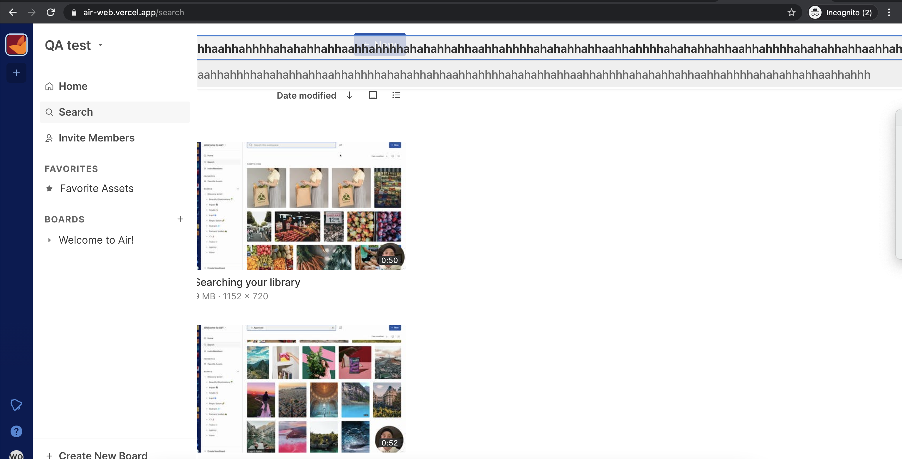
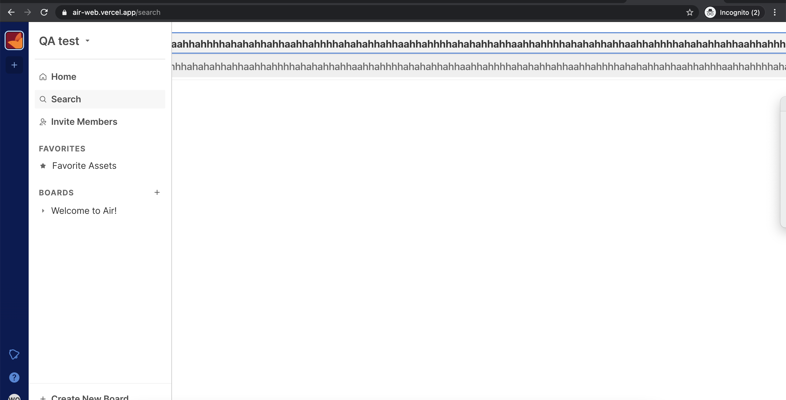

# Air QA Test Challenge

### Bug Tracking Report

#### ID-01 - Home Page - Search Area - There is no characters limit for the search entry - It is hidding workspace content
Type: Bug
Priority: Minor
Severity: Minor

##### Environment:
Macbook Pro 16 2019
Browser - Google Chrome Version 90.0.4430.93 (Official Build) (x86_64)
Env - PROD -  https://air-web.vercel.app/search

##### Description
It was possible to verify that there is not character limits on the search box on Homepage.
So it is possible to expand the search and it is not possible to see the workspace when its happening. 

##### Reproduction Route - Pre conditions
1. User Logged in

##### Reproduction Route - Steps to reproduce
1. Visit http://test.getgrex.com/
2. Click on Search on this workspace modal
3. Add a long string 
> ```bash
> E.g: hahahhahahahhahahahhahahahhahahahhahahahhahahahhahahahhahahahhahahahhahahahhahahahhahahahhahahahhahahahhahahahhahahahhahahahhahahahhahahahhahahahhahahahhahahahhahahahhahahahhahahahhahahahha
> ```
4. Verify workspace homepage is not beeing visible when adding more characters.

##### Actual Result
User is able to add a long string with no characters limit and it is hidding the workspace content.

##### Expected Result
User should not be able to add more than XXX (defined with requirements) characters. Or when adding a long string it could break the lines number and doesn't affect the workspace content.

##### Additional Information
See more details on recorded video and screenshots here: ...




