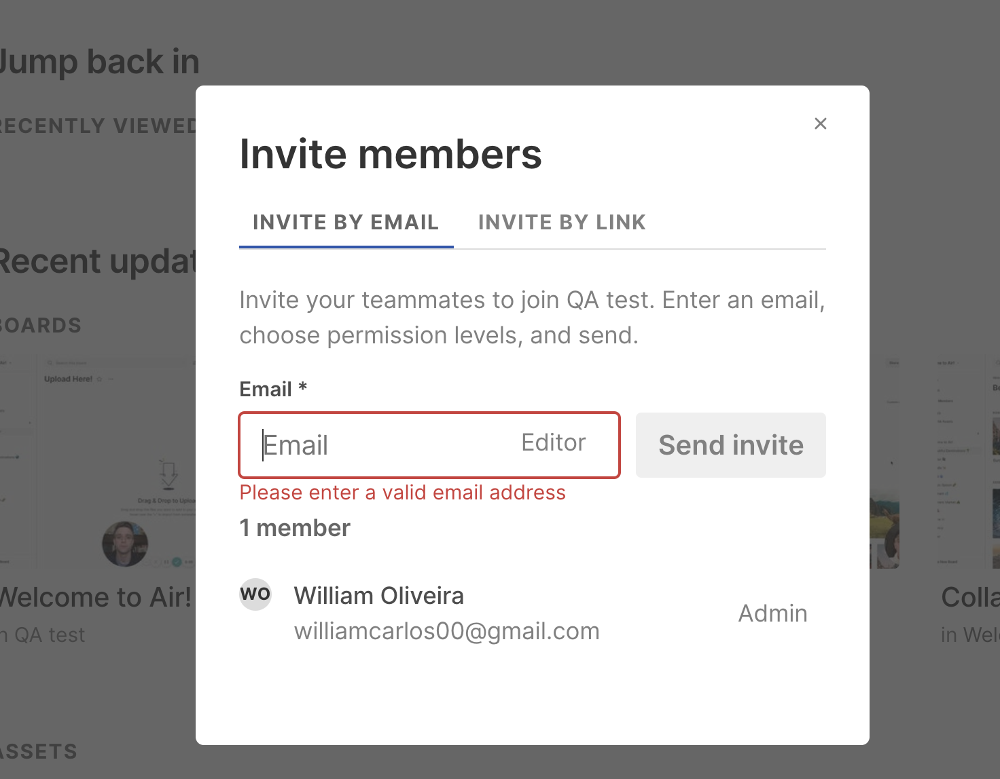
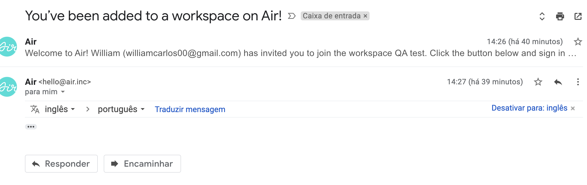
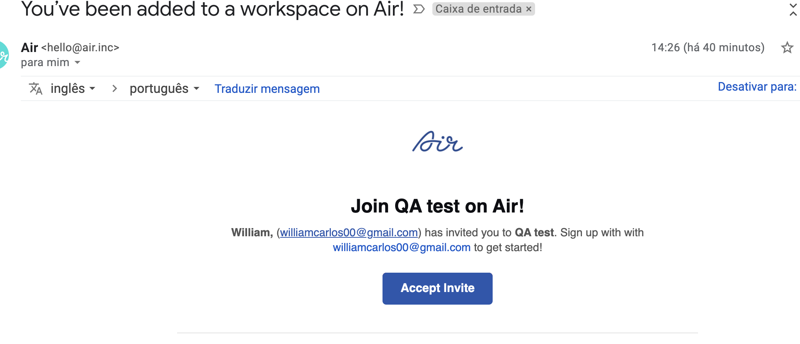
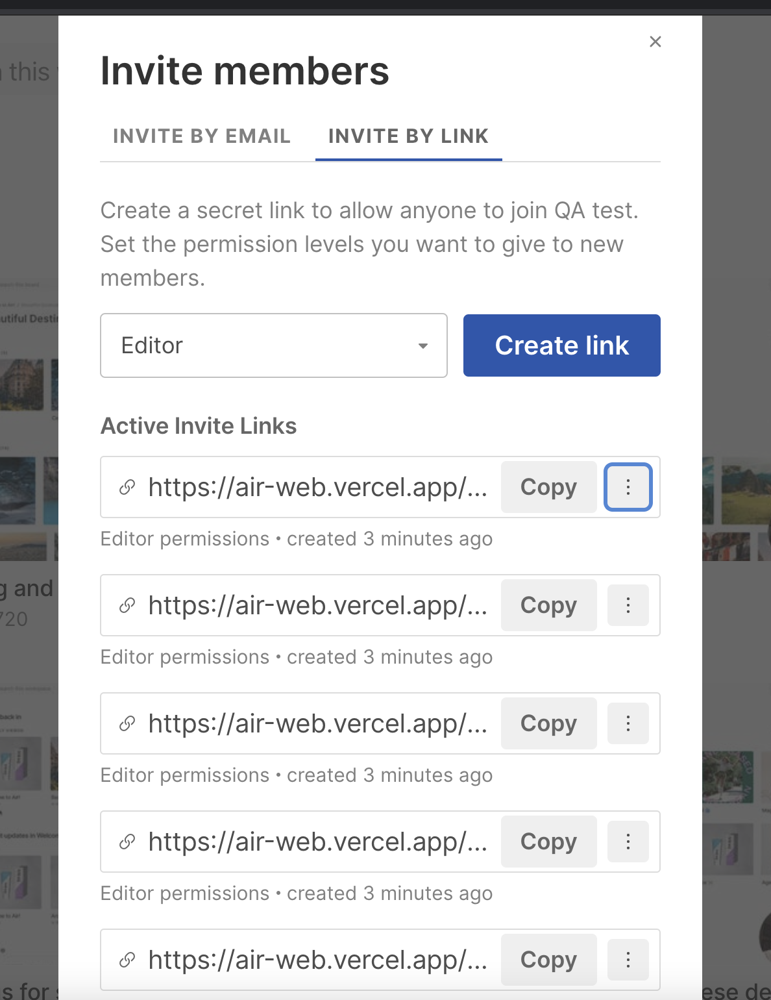

# Air QA Test Challenge

### Bug Tracking Report

#### ID-01 - Home Page - Search Area - There is no characters limit for the search entry - It is hidding workspace content
Type: Bug
Priority: Minor
Severity: Minor

##### Environment:
Macbook Pro 16 2019
Browser - Google Chrome Version 90.0.4430.93 (Official Build) (x86_64)
Env - PROD -  https://air-web.vercel.app/search

##### Description
It was possible to verify that there is not character limits on the search box on Homepage.
So it is possible to expand the search and it is not possible to see the workspace when its happening. 

##### Reproduction Route - Pre conditions
1. User Logged in

##### Reproduction Route - Steps to reproduce
1. Visit https://air-web.vercel.app/
2. Click on Search on this workspace modal
3. Add a long string 
> ```bash
> E.g: hahahhahahahhahahahhahahahhahahahhahahahhahahahhahahahhahahahhahahahhahahahhahahahhahahahhahahahhahahahhahahahhahahahhahahahhahahahhahahahhahahahhahahahhahahahhahahahhahahahhahahahhahahahha
> ```
4. Verify workspace homepage is not beeing visible when adding more characters.

##### Actual Result
User is able to add a long string with no characters limit and it is hidding the workspace content.

##### Expected Result
User should not be able to add more than XXX (defined with requirements) characters. Or when adding a long string it could break the lines number and doesn't affect the workspace content.

##### Additional Information
See more details on recorded video and screenshots here: ...


#### ID-02 - Invite Members - User can invite I memeber already registered into the workspace
Type: Bug
Priority: Normal
Severity: Normal

##### Environment:
Macbook Pro 16 2019
Browser - Google Chrome Version 90.0.4430.93 (Official Build) (x86_64)
Env - PROD -  https://air-web.vercel.app/

##### Description
It was possible to verify that the user is able to invite a member already registered into the workspace.

##### Reproduction Route - Pre conditions
1. Login with the user - williamcarlos00@gmail.com - Test123.

##### Reproduction Route - Steps to reproduce
1. Visit https://air-web.vercel.app/
2. Click on Invite Members Section
3. Click on email modal
4. Insert the same member email from the login - williamcarlos00@gmail.com
5. Verify invitation is successfully sent

##### Actual Result
It is possible to invite users already registered into the workspace to be joining again.
Also, it is possible to invite the same user from login, with the same email.

##### Expected Result
User should be able to invite new member using new emails. It should not be possible to invite your self or send a message that the user is already member of the workspace in use.

##### Additional Information
See more details on recorded video and screenshots here: ...






#### ID-03 - Invite Members - User can invite the same user several times
Type: Bug
Priority: Normal
Severity: Normal

##### Environment:
Macbook Pro 16 2019
Browser - Google Chrome Version 90.0.4430.93 (Official Build) (x86_64)
Env - PROD -  https://air-web.vercel.app/

##### Description
It was possible to verify that the user is able to invite the same user several times

##### Reproduction Route - Pre conditions
1. Login with the user - williamcarlos00@gmail.com - Test123.

##### Reproduction Route - Steps to reproduce
1. Visit https://air-web.vercel.app/
2. Click on Invite Members Section
3. Click on email modal
4. Insert a new email to invite
> ```bash
> E.g: testuserair@mailinator.com
> ```
5. Click to Invite
6. Verify invitation is successfully sent
7. Add the same email from step 4 on email modal
8. Click to Invite
9. Verify invitation is successfully sent

##### Actual Result
It is possible to iinvite the same user several times. 

##### Expected Result
User should be able to invite a new user once and then this user could be added into the workspace with status "awaiting the response"
when this status is visible the same user could not be invited again. It will avoid a couple of emails and crete a status validation.
From the workspace admin, it is also possible to display a message "This user is already invited, we are waiting its the response"

##### Additional Information
See more details on recorded video and screenshots here: ...
On this case, 2 invitations for the same user.


#### ID-04 - Invite Members - There is no message regarding the maximum invitation links available per plan
Type: Bug
Priority: Normal
Severity: Normal

##### Environment:
Macbook Pro 16 2019
Browser - Google Chrome Version 90.0.4430.93 (Official Build) (x86_64)
Env - PROD -  https://air-web.vercel.app/

##### Description
It was possible to verify that there is no message or information regarding the maximum inviatation link.
For example, how many user you can invite per plan. How many invites that you sent, how many are available.

##### Reproduction Route - Pre conditions
1. Login with the user - williamcarlos00@gmail.com - Test123.

##### Reproduction Route - Steps to reproduce
1. Visit https://air-web.vercel.app/
2. Click on Invite Members Section
3. Click on Invite by Link option
4. Click to create link 
5. Repeat the step for 10x
6. Verify there is no message regarding the number of invitation that are available to send.

##### Actual Result
It is possible to create a lot of new invites via link. However there is no message regarding its limit.

##### Expected Result
User should be able to see the number of invites available to be send by your plan limit.
For example: basic 1000, pro 10000

##### Additional Information
See more details on recorded video and screenshots here: ...


