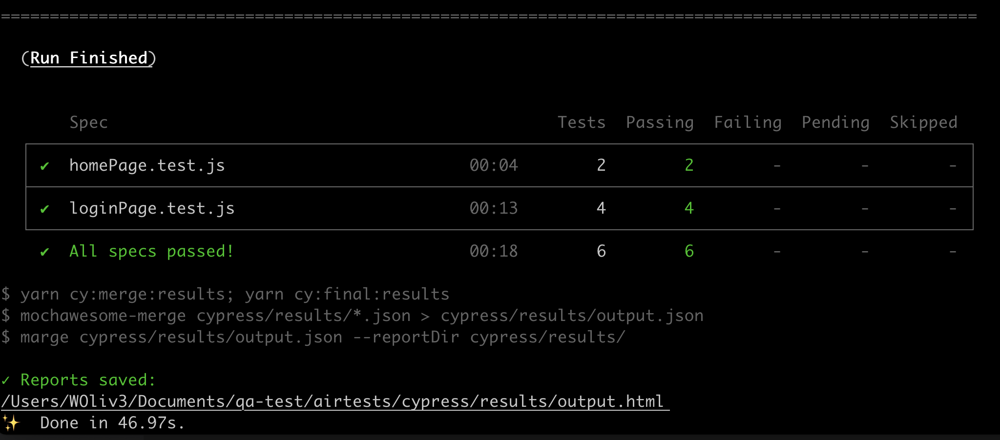
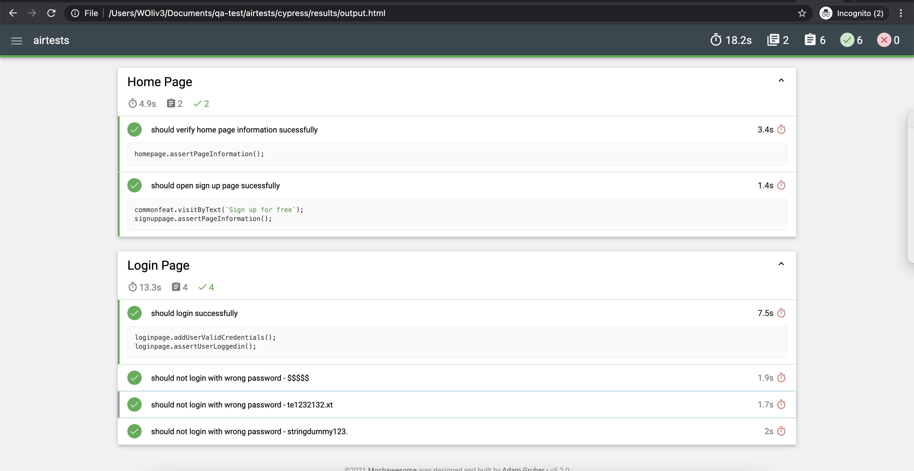
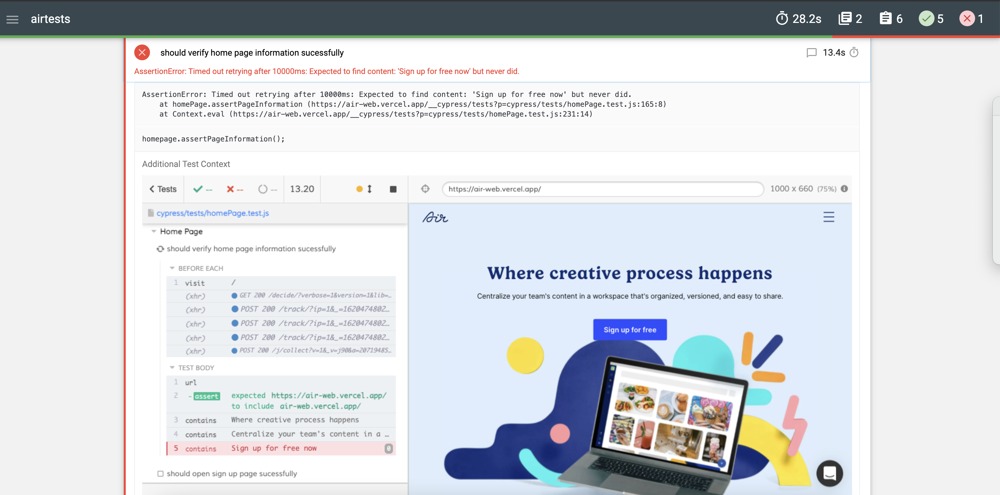

### Introduction

In this current repo you will be able to test some scenarios created by the challenge received using [Cypress](https://www.cypress.io/). If you need to understand a bit more about Cypress, the API documentation is available [here](https://docs.cypress.io/api/api/table-of-contents.html). 

### Dependencies
You need to install the Node.js to execute this test project. Download the latest Node available version [here](https://nodejs.org/pt-br/download/). Also, you can install via cli (MAC or Linux) using the Node Version Manager with the following commands:

> ```bash
> curl -o- https://raw.githubusercontent.com/creationix/nvm/v0.33.1/install.sh | bash
>
> nvm install node
>
> nvm use node
> # Checking the version
> npm -v
> ```

After the completed node's installation, you will need to clone this current repo.

> ```bash
> # Git Links
> https://github.com/willcoliveira/airtests.git
> git@github.com:willcoliveira/airtests.git
> ```

### Installing the dependencies 
Open the repo folder and install all dev dependencies using:
> ```bash
> yarn 
> ```

You will see the following messages: 
> ```bash
> yarn install v1.15.2
> info No lockfile found.
> [1/4] 🔍  Resolving packages...
> [2/4] 🚚  Fetching packages...
> [3/4] 🔗  Linking dependencies...
> [4/4] 🔨  Building fresh packages...
> success Saved lockfile.
> ```

### How to Run the tests using Cypress Interface

To run the specs with headed GUI and have a way to debug the tests start Cypress using: 

> ```bash
> yarn cy:open
> ```

With the command above, Cypress interface will be open and you can select the browser and the exactly file that you want to run. In addition, you are able to select to run all files directly clicking on "Run All Specs" Button.

Also, you can run all the tests using the cli however with a browser opened to follow the whole execution
> ```bash
> yarn cy:run:chrome
> ```

Or in headless mode
> ```bash
> yarn cy:run:headless
> ```

### How to analyse the Cypress Test Results

This resolution is using mochawesome plugin as its report generator. So, once the execution is done after the one of the commands below:

> ```bash
> yarn cy:run:headless or yarn cy:run:chrome
> ```



You will be able to see a full report on  the link previous created as it is possible to see on the image above

> ```bash
>/Users/williamoliveira/Documents/Cypress/oneMineral/cypress/results/output.html
> ```
 
### Final Report


### Final Report with Failures
Also, If the test fails it will show the exactly step and a screenshot of that moment.



================================================

### Manual Test Part - Introduction
The application under test were tested using Chrome and it is possible to see it's bugs [BUGs](BUG.md)
